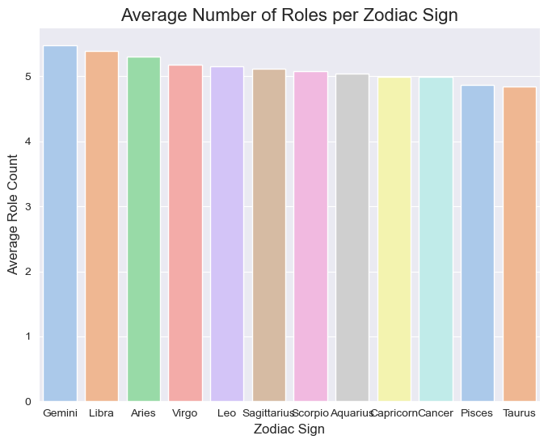
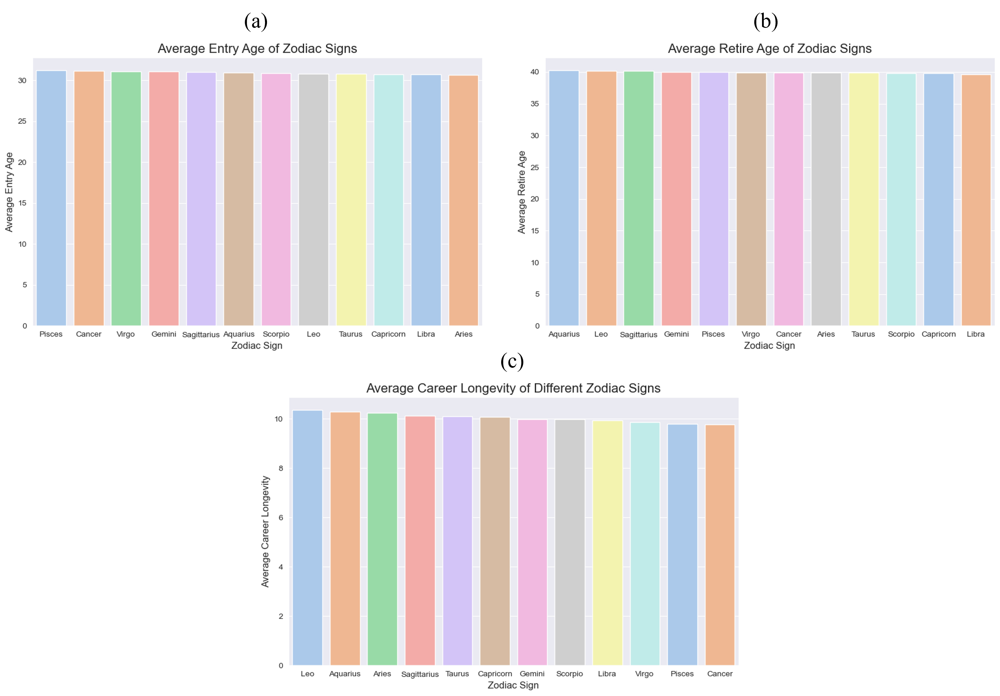
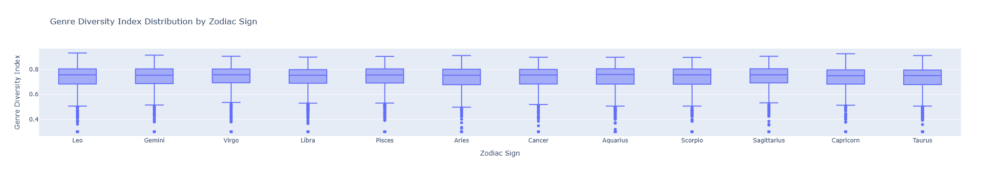
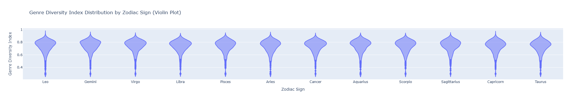
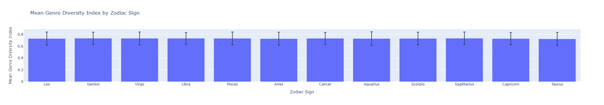
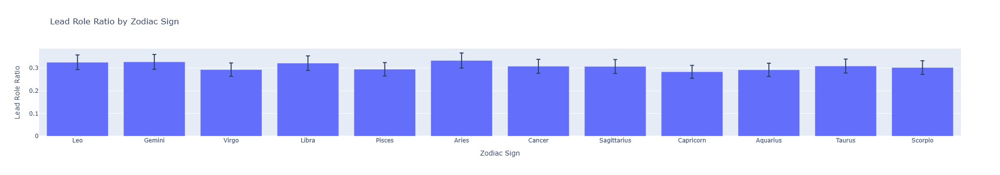
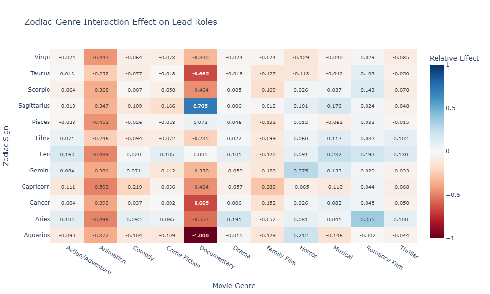
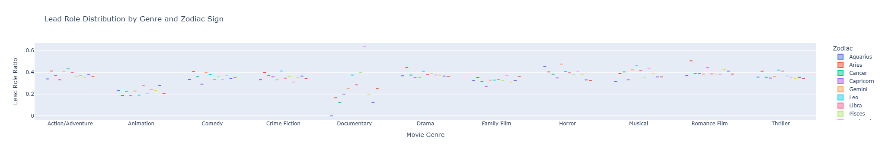
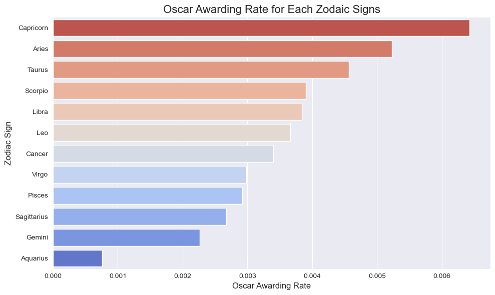

# 5pebbles Project Analysis

## Distribution Analysis
1.⁠ ⁠(1) *Distribution Analysis*: After group the actors into different zodiac signs, we will calculate the distribution. Then we will utilise chi-square to determine if the differences between the zodiac signs are significant or not.

## Movie Count

> code at: https://github.com/epfl-ada/ada-2024-project-5pebbles/blob/Zhichen/results.ipynb


Research question: Do actors with different zodiac signs have a a significant difference in the number of movies they participate.


Methodology: 
1. Group the actors by their zodiac signs.
2. Conduct an ANOVA analysis to determine whether the distribution of movie counts varies significantly across different zodiac signs.


Here's the distribution of movie counts across actors with different zodiac signs:



We use ANOVA Analysis to check if actors with different zodiac signs have a significant difference in the number of movies they participate. Here are the procedures of the ANOVA analysis:

1. **Define the variables**: Let $\mu_i$ represent the mean number of movies for actors with the $i$-th zodiac sign, where $i = 1, 2, \dots, 12$.

2. **Null Hypothesis (\(H_0\)):**  
   The mean number of movies for actors with different zodiac signs is the same.  
   
   $H_0: \mu_1 = \mu_2 = \mu_3 = \cdots = \mu_{12}$
   

3. **Alternative Hypothesis (\(H_A\)):**  
   At least one zodiac sign has a significantly different mean number of movies.  
   $H_A: \text{At least one } \mu_i \text{ is different.}$

4. **Hypothesis Testing**:
    
    The statistic of ANOVA analysis is as follows (rounded to 3 digits):

    ```bash
    F-statistic: 1.800
    P-value: 0.048
    ```
    With confidence level $\alpha=0.05$, we can reject the null hypothesis, indicating actors with different zodiac signs DO have a a significant difference in the number of movies they participate.


## Career Logevity
3.⁠ ⁠(6) *Career longevity*: How do zodiac signs correlate with actors' career longevity, examining the timespan from their first to last movie appearances?  

The careers of different actors vary greatly. Some have very long careers, while others are much shorter. Some start acting in films at a very young age, while others continue acting well into old age. We aim to analyze the length of actors' careers, as well as whether their entry age and retirement age are related to their zodiac signs. The results are showned in the following picture.  



Actors of all zodiac signs generally have their first film role around the age of 30 and their last film role around the age of 40, with an average career span of about 10 years. Although there are slight differences between different zodiac signs, the results of ANOVA analysis show that none of the difference is significant.

|                  | F-Statistic | P-Value |
|------------------|-------------|---------|
| Entry AGE        | 0.634       | 0.800   |
| Retire Age       | 0.366       | 0.969   |
| Career Longevity | 0.815       | 0.625   |

## Genre Analysis
4.⁠ ⁠(2) *Genre Analysis* Preferences for movie genres among actors of different zodiac signs: ① Calculate the distribution of different genre ② Calculate the genre distribution of each sign ③ Divide the two proportion ④ use statstical method to test if the trends are significant.

## Casting Preferences
5.⁠ ⁠(3) *Casting preferences* :① Calculate the distribution of different genre ② Calculate the genre distribution of each sign③ Divide the two proportion ④ use statstical method to test if the trends are significant. (Ren Yi, need normalization, could refer to maskymiliann)

Research Question: Is the zodiac distribution of a certain movie genre significantly different from the overall zodiac distribution?

Methodology:
1. Calculate the overall zodiac distribution across all movies.
2. Calculate the zodia distribution of a certain movie genre (for example, Action movies)
3. Use chi-squared test to see if these two distributions are significantly different, and to see what contributes to this difference.

Chi-squared test procedures, take the Action films as the example

1. Define the null hypothesis (H0): There is no significant difference between the overall zodiac distribution across all movies and the zodiac distribution of the selected movie genre.

2. Define the alternative hypothesis (H1): There is a significant difference between the two distributions.

3. Create a contingency table that includes the observed counts of zodiac signs for the overall distribution and the selected movie genre.

      |    | Aquarius | Aries  | Cancer | Capricorn | Gemini | Leo   | Libra | Pisces | Sagittarius | Scorpio | Taurus | Virgo  |
      |---------------|----------|--------|--------|-----------|--------|-------|-------|--------|-------------|---------|--------|--------|
      | **Total**     | 80,131   | 81,596 | 82,128 | 74,011    | 85,994 | 84,755 | 83,247 | 79,976 | 76,220      | 78,519  | 77,232 | 81,731 |
      | **Action**    | 3,411    | 3,270  | 3,479  | 3,002     | 3,610  | 3,549  | 3,389  | 3,189  | 3,183       | 3,067   | 2,950  | 3,544  |


1. Calculate the expected counts for each zodiac sign under the null hypothesis. These can be calculated as: $\text{Expected Count} = \frac{\text{Total count in category} \times \text{Total count in group}}{\text{Grand Total}}$


   | Zodiac Sign   | Aquarius  | Aries    | Cancer   | Capricorn | Gemini   | Leo      | Libra    | Pisces   | Sagittarius | Scorpio   | Taurus   | Virgo    |
   |---------------|-----------|----------|----------|-----------|----------|----------|----------|----------|-------------|-----------|----------|----------|
   | **Total**     | 80,247.22 | 81,519.0 | 82,230.78| 73,975.72 | 86,070.14| 84,821.41| 83,219.20| 79,885.09| 76,271.46   | 78,368.36 | 77,019.73| 81,911.87|
   | **Action**    | 3,294.78  | 3,347.0  | 3,376.22 | 3,037.28  | 3,533.86 | 3,482.59 | 3,416.80 | 3,279.91 | 3,131.54    | 3,217.64  | 3,162.27 | 3,363.13 |


1. Compute the chi-squared statistic using the formula:
   $\chi_{i,j}^2 = \frac{(O_{i,j} - E_{i,j})^2}{E_{i,j}}, \chi^2 = \sum_i \sum_j \chi_{i,j}^2$
   Where $O$ represents the observed counts, and $E$ represents the expected counts, $i$ represents the distribution (overall distribution or the selected genre distribution), $j$ represents the zodiac sign.

   | Zodiac Sign   | Aquarius | Aries | Cancer | Capricorn | Gemini | Leo   | Libra | Pisces | Sagittarius | Scorpio | Taurus | Virgo  |
   |---------------|----------|-------|--------|-----------|--------|-------|-------|--------|-------------|---------|--------|--------|
   | **Total**     | 0.17     | 0.07  | 0.13   | 0.02      | 0.07   | 0.05  | 0.01  | 0.10   | 0.03        | 0.29    | 0.58   | 0.40   |
   | **Action**    | 4.10     | 1.77  | 3.13   | 0.41      | 1.64   | 1.27  | 0.23  | 2.52   | 0.85        | 7.05    | 14.25  | 9.73   |

   $\chi^2_{action}=48.84$

2. Determine the degrees of freedom (df), which is given by:
   $\text{df} = (\text{Number of rows} - 1) \times (\text{Number of columns} - 1) = 11$


3. Compare the chi-squared statistic to the critical value from the chi-squared distribution table at a chosen significance level (e.g., $\alpha = 0.05$) or compute the p-value.
   
   According to the [Chi-Square Distribution Table](https://math.arizona.edu/~jwatkins/chi-square-table.pdf), $\chi^2_{0.050}=19.675$ when the degree of freedom is 11.

4. Interpret the results:
   - If the chi-squared statistic exceeds the critical value or the p-value is less than the significance level, reject the null hypothesis.
     - In the Action films, $\chi^2_{action}=48.84 > \chi^2_{0.050}=19.675$.
     - Therefore, at the 95% confidence level, we reject the null hypothesis.
   - Otherwise, fail to reject the null hypothesis.

5. Identify which zodiac signs contribute most to the observed differences by examining the chi-squared statistic for each genre-zodiac cell, as is shown in step 5.

   Larger results indicate greater contributions to the chi-squared statistic.

   Here are the top 3 Chi-Square Statistics,

   | Zodiac Sign | Action |
   |-------------|--------|
   | Taurus      | 14.25  |
   | Virgo       | 9.73   |
   | Scorpio     | 7.05   |

   which indicates that the distributions of Taurus, Virgo, and Scorpio are the most significantly different between all films and Action films.

Chi-square tests for top 20 popular movie genres are conducted. You could find the result in [genre-zodaic-chi-square.md](./genre-zodiac-chi-square.md).

In these 20 genres 
- 5 genres (Adventure, Romantic drama, Fantasy, Science Fiction, Crime Thriller) are **independent** with zodiac signs.
- 15 genres (Drama, Comedy, Romance Film, Thriller, Action, Crime Fiction, Action/Adventure, World cinema, Black-and-white, Indie, Family Film, Horror, Musical, Romantic comedy, Mystery) illustrate **dependency** with zodiac signs.


## Dancing Through Genres - The Art of Versatility
6.⁠ ⁠(7) *Type Diversity Index*: Which zodiac signs demonstrate greater versatility in genre-switching, and how successful are they in different genres throughout their careers?

### The Question of Versatility

In our continuing exploration of zodiac signs' influence on acting careers, we arrive at an intriguing question: Does an actor's zodiac sign influence their ability to navigate different film genres? To answer this, we developed a sophisticated metric called the Genre Diversity Index (GDI) to measure actors' versatility across different film genres.

Think of actors as painters with films as their canvas - some work with a broad palette of genres, while others perfect their craft within a specific style. Just as a masterful artist might move between watercolors and oils, versatile actors transition between comedy and drama, action and romance. But does the cosmic alignment at the time of their birth influence this artistic flexibility?

### Measuring Genre Diversity

To capture this artistic versatility in numerical terms, we crafted the Genre Diversity Index (GDI) - a sophisticated measure that acts like a theatrical report card. Imagine evaluating a chef's versatility not just by the number of dishes they can cook, but also by how well they balance their menu and how confidently they execute each cuisine type. Similarly, our GDI looks at three crucial aspects of an actor's genre performance:

1. **Raw Diversity Score (30% weight)**
   - Measures how many different genres an actor has explored
   - Like counting the colors in an artist's palette

2. **Shannon Diversity Index (40% weight)**
   - Measures how evenly an actor distributes their performances
   - Similar to evaluating how well an artist uses all their colors

3. **Genre Balance Score (30% weight)**
   - Measures the balance between most and least frequent genres
   - Like assessing if an artist favors certain colors too heavily


*Our box plot reveals the distribution of Genre Diversity Index across zodiac signs, showing median values and outliers.*

### What the Numbers Tell Us

Analyzing over 12,000 actors' careers revealed fascinating patterns:

1. **Top Performers**
   - Sagittarius leads with a GDI of 0.733379
   - Gemini follows extremely closely at 0.733362
   - Libra ranks third with 0.732426

2. **Lower Range**
   - Taurus (0.722559)
   - Aries (0.726952)
   - Capricorn (0.727069)

These numbers tell a story of subtle cosmic influence. Consider how Sagittarius, known for its adventurous spirit, shows the highest versatility - perhaps reflecting their astrological reputation for exploring new territories. Meanwhile, Gemini's close second place aligns with their dual nature, suggesting an innate ability to adapt to different theatrical demands.

The clustering of scores within such a tight range (0.722-0.733) tells us something remarkable about professional acting - regardless of zodiac sign, successful actors tend to develop significant versatility. It's as if the demands of the craft itself shape performers more than their astrological predispositions.


*The violin plot shows the full distribution shape of GDI scores across zodiac signs.*

### Statistical Insights

Our statistical analysis using the Kruskal-Wallis test revealed:
- H-statistic: 14.364
- p-value: 0.213
- Effect size (η²): 0.000

These results suggest that while we observe small differences in genre diversity across zodiac signs, these differences aren't statistically significant. In other words, while the stars might whisper suggestions about an actor's path, they don't shout commands. The small differences we observe are like subtle brushstrokes in a larger masterpiece - interesting to note but not defining the overall picture.


*The bar chart displays mean GDI values with standard deviation for each zodiac sign.*

### Key Findings

1. **Minimal Variation**
   - GDI scores cluster tightly between 0.722 and 0.733
   - Very small variance between highest and lowest scores (difference of ~0.01)

2. **Consistency Across Signs**
   - High mean GDI scores (>0.72) across all signs
   - Suggests that successful actors generally maintain diverse portfolios regardless of zodiac sign

3. **Variance Patterns**
   - Aquarius shows highest variability (SD: 0.115085)
   - Libra shows most consistency (SD: 0.098141)

### Conclusion

Just as the night sky presents a complex tapestry of stars, our analysis reveals an intricate pattern of artistic versatility among actors. While zodiac signs might add a touch of celestial flavor to an actor's career journey, the true story appears to be one of human adaptability and professional growth.

Our Genre Diversity Index analysis reveals that while subtle patterns exist in how different zodiac signs approach genre diversity, these differences are minimal and not statistically significant. The consistently high GDI scores across all signs suggest that versatility in acting may be more related to career opportunities and professional choices than astrological influences.

This analysis provides a quantitative foundation for understanding how actors navigate different genres throughout their careers, while maintaining scientific rigor in our examination of potential zodiac influences.

## The Stars Align: A Deep Dive into Zodiac Signs and Lead Roles in Cinema
7.⁠ ⁠(5) *Power Role Analysis*: ① Map each actor’s zodiac sign to their respective role ② Use statistical methods (e.g., chi-square tests, logistic regression) to determine if there is a significant association between zodiac signs and the likelihood of being cast in specific roles. Analyze trends and compare how often actors of certain signs are cast as heroes versus villains or sidekicks.


In the vast constellation of Hollywood, we've often wondered: do the stars that guided an actor's birth influence their path to stardom? As part of our comprehensive study exploring the relationship between zodiac signs and acting careers, we delved into one of the most intriguing questions - does an actor's zodiac sign correlate with their likelihood of landing lead roles?

### The Celestial Distribution


*Lead Role Ratio Across the Zodiac*

At first glance, our data reveals a fascinating pattern. Like the bright stars of Aries dominating the spring sky, actors born under this sign shine brightest in our analysis, securing lead roles in 33.34% of their appearances. This isn't just celestial coincidence - our statistical analysis confirms these differences are significant, with both chi-square and Kruskal-Wallis tests yielding p-values below 0.001.

The zodiac wheel seems to favor fire and air signs, with Gemini (32.75%) and Leo (32.57%) following closely behind Aries. Perhaps there's something to the ancient wisdom about fire signs' natural leadership qualities and air signs' adaptability. Meanwhile, Capricorn, traditionally associated with steady climbing, surprisingly shows the lowest lead role ratio at 28.36%.

### When Stars Meet Genre


*Heat Map of Zodiac-Genre Interaction Effects in Lead Roles*

But the story gets even more interesting when we look at how different signs perform across various film genres. Our heatmap reveals some truly stellar connections:

Imagine a Sagittarius documentary filmmaker, capturing truth through their lens - our data shows they're 70.49% more likely to lead in documentaries! Though with a small sample size, it's like spotting a rare celestial event - fascinating but requiring careful interpretation.

The romance genre tells an equally compelling tale. Aries actors, with their passionate nature, show a remarkable 35.46% higher likelihood of leading romantic films. With over 1,400 cases in our sample, this is no shooting star - it's a consistent pattern worth noting.


*Lead Role Distribution Patterns Across Movie Genres by Zodiac Sign*


Horror films reveal their own cosmic connections, with Gemini actors showing a 27.50% higher chance of leading these spine-chilling tales. Perhaps their dual nature makes them particularly adept at portraying complex, horror-worthy characters?

### The Dark Side of the Moon

Not every celestial alignment is favorable. Our data reveals some interesting voids - particularly in animation voice acting, where every zodiac sign shows negative correlations. It's like a cosmic eclipse affecting all signs equally, suggesting this might be more about industry practices than astrological influence.

The documentary genre also shows some interesting shadows, with certain signs showing strong negative correlations. However, like trying to spot a distant planet, our small sample sizes in this category require us to view these findings through a properly calibrated telescope.

### Statistical Constellations

Our ANOVA results add another layer to this cosmic story. With an F-statistic of 10.095 (p < 0.001) for zodiac signs and even stronger results for genre effects (F = 92.514, p < 4.50e-192), we're seeing clear evidence that these patterns aren't just random stellar noise.

The effect sizes might be subtle - like distant stars whose light is faint but measurable - with our Cramer's V of 0.033 suggesting a small but meaningful influence. It's a reminder that in both astronomy and cinema, significant patterns don't always need to be obvious to be important.

### Charting the Future

What does this celestial map mean for the film industry? While we're not suggesting casting directors should consult their ephemeris, our findings provide an interesting lens through which to view talent distribution in cinema. Like ancient astronomers finding patterns in the night sky, we've uncovered correlations that, while not definitively causal, offer fascinating insights into the relationship between birth dates and career trajectories.

Our analysis continues as part of a larger exploration of zodiac influences in cinema, but this chapter reveals that perhaps, in some small way, the stars of our birth might indeed influence our path to the stars of Hollywood.

## Oscar Analysis
8.⁠ ⁠(8) *Oscar Analysis*: Are actors of different zodiac signs equally likely to win an Oscar? Which zodiac sign has the highest probability of winning an Oscar?

The Academy Awards, commonly known as the Oscars, are annual awards presented by the Academy of Motion Picture Arts and Sciences (AMPAS) to honor outstanding achievements in the film industry. First held in 1929, the Oscars have become one of the most prestigious and widely recognized accolades in cinema. In this analysis, we gathered the data of the winner of best actor and best actress from 1929-2023 and analyzed the awarding rate of different zodaic signs.  

Methology:  
1. Calculate the zodiac distribution of Oscar winners
2. Calculate the awarding rate of different zodiac signs
3. Use z-score and Chi-square Test to test if the differences of awarding rate among different zodiac signs are significant

  

Capricorn, Aries, and Taurus are the top three zodiac signs with the highest winning rates, while Aquarius, Gemini, and Sagittarius are the three zodiac signs with the lowest winning rates.  

We applied a z-score test to assess the statistical significance of these differences. Among the 12 zodiac signs, actors born under Capricorn have a significantly higher awarding rate than the average (z-score = 2.985, p-value < 0.05), while those born under Aquarius have a significantly lower awarding rate than the average (z-score = -2.949, p-value < 0.01). For other zodiac signs, the differences in awarding rates compared to the average are not statistically significant. Additionally, we conducted a Chi-Square test to examine whether awarding rates are significantly correlated with zodiac signs. The results (chi-square statistic = 14.177, p-value=0.223) indicates that although the awarding rates of some zodiac sign are significant different from the avarage, Overall, there is no significant correlation between zodiac signs and awarding rates.

**result of z-score**

| Zodiac Sign | Awarding Rate | Z-Score | P-Value | Significant? |  
|-------------|---------------|---------|---------|--------------|   
| Capricorn   | 6.43‰         | 2.985   | 0.003   | True         |    
| Aquarius    | 0.76‰         | -2.949  | 0.003   | True         |  


## Miscellaneous


